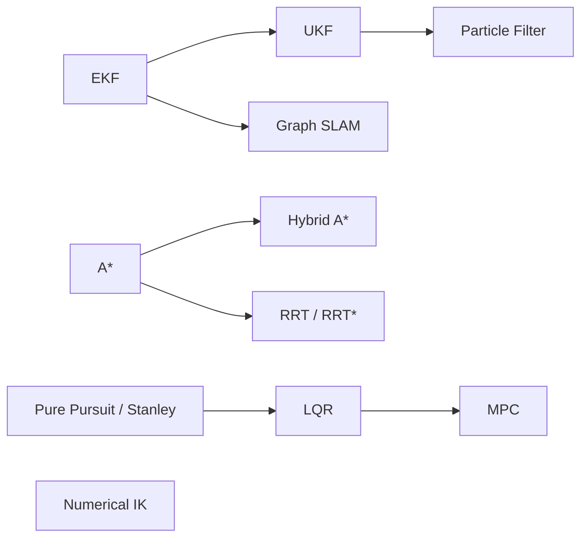

<div align="center">

# 🤖 robotics-algorithms

**From-scratch implementations of core robotics algorithms in Python and C++17**
*Derived, implemented, tested, and validated, one algorithm at a time.*

[](https://github.com/ppranav04/robotics-algorithms/actions/workflows/ci.yml)


[Roadmap](#-roadmap) · [Approach](#-approach) · [Quick Start](#-quick-start) · [Structure](#-repository-structure) · [References](#-references)

</div>

---

## 📌 About

This repository is a structured study of the algorithms behind robot state estimation, mapping, planning, and control. Each algorithm lives in its own folder and is built twice:

| | Role |
|---|---|
| 🐍 **Python** | Reference implementation, used to work out the math and iterate quickly |
| ⚙️ **C++17 + Eigen** | Engineering implementation, built with CMake and unit-tested with GoogleTest |

Both implementations run on the **same scenario data file** and are checked against each other, so the C++ version is verified rather than assumed correct.

> [!NOTE]
> This is a learning repository. Each algorithm's README contains the derivation in my own words, the assumptions it depends on, and results I measured myself.

---

## 🗺️ Roadmap

**Legend:** ✅ Done · 🚧 In progress · ⬜ Planned

### 📍 Localization

| Algorithm | Python | C++ | Tests | Docs | Validation |
|---|:---:|:---:|:---:|:---:|---|
| [Extended Kalman Filter](localization/ekf) | ✅ | ⬜ | ⬜ | ⬜ | Jacobian check, NEES/NIS |
| [Unscented Kalman Filter](localization/ukf) | ⬜ | ⬜ | ⬜ | ⬜ | NEES vs. EKF |
| [Particle Filter](localization/particle_filter) | ⬜ | ⬜ | ⬜ | ⬜ | RMSE vs. particle count |

### 🗺️ SLAM

| Algorithm | Python | C++ | Tests | Docs | Validation |
|---|:---:|:---:|:---:|:---:|---|
| [Graph-Based SLAM](slam/graph_slam) | ⬜ | ⬜ | ⬜ | ⬜ | Drift before/after optimization |

### 🧭 Path Planning

| Algorithm | Python | C++ | Tests | Docs | Validation |
|---|:---:|:---:|:---:|:---:|---|
| [A*](planning/a_star) | ⬜ | ⬜ | ⬜ | ⬜ | Optimality vs. Dijkstra |
| [Hybrid A*](planning/hybrid_a_star) | ⬜ | ⬜ | ⬜ | ⬜ | Kinematic feasibility |
| [RRT / RRT*](planning/rrt_star) | ⬜ | ⬜ | ⬜ | ⬜ | Cost convergence vs. iterations |

### 🎯 Path Tracking & Control

| Algorithm | Python | C++ | Tests | Docs | Validation |
|---|:---:|:---:|:---:|:---:|---|
| [Pure Pursuit / Stanley](path_tracking/pure_pursuit_stanley) | ⬜ | ⬜ | ⬜ | ⬜ | Cross-track error |
| [LQR](path_tracking/lqr) | ⬜ | ⬜ | ⬜ | ⬜ | Tracking error vs. Q/R |
| [Model Predictive Control](path_tracking/mpc) | ⬜ | ⬜ | ⬜ | ⬜ | Constraint satisfaction |

### 🦾 Manipulation

| Algorithm | Python | C++ | Tests | Docs | Validation |
|---|:---:|:---:|:---:|:---:|---|
| [Numerical IK (Damped Least Squares)](arm/numerical_ik) | ⬜ | ⬜ | ⬜ | ⬜ | Convergence near singularities |

### Learning path



---

## 🧪 Approach

An algorithm is marked ✅ **only** when it meets all four criteria:

1. **Python reference** runs on the shared scenario data.
2. **C++ implementation** matches the Python output within tolerance on the same data.
3. **Tests check correctness**, not just that the code runs (for example, analytic Jacobians against finite differences, and filter consistency via NEES).
4. **Documentation** covers the derivation, assumptions, and measured results.

Design rules applied throughout:

- **Shared data files, not shared seeds.** NumPy and C++ random generators produce different streams, so each scenario is generated once and saved as CSV for both languages to read.
- **Algorithm code stays pure.** Filters, planners, and controllers contain no plotting or file I/O. Demos handle that separately, which keeps the core logic testable.
- **Measured results only.** Every number reported comes from a run I can reproduce.

---

## 🚀 Quick Start

### Python

```bash
python -m venv .venv && source .venv/bin/activate
pip install -r requirements.txt

# Run a demo
python localization/ekf/python/demo.py

# Run all Python tests
pytest
```

### C++

**Requirements:** C++17 compiler, CMake ≥ 3.16, Eigen3

```bash
# Build and test everything
cmake -B build -DCMAKE_BUILD_TYPE=Release
cmake --build build
ctest --test-dir build --output-on-failure

# Or build a single algorithm on its own
cmake -S localization/ekf/cpp -B build/ekf
cmake --build build/ekf
```

---

## 📁 Repository Structure

Each algorithm is a self-contained study, organized by area:

<details>
<summary><b>Click to expand</b></summary>

```
robotics-algorithms/
├── README.md
├── requirements.txt
├── CMakeLists.txt              # builds every algorithm for CI
├── .github/workflows/ci.yml
└── localization/
    └── ekf/
        ├── README.md           # derivation, assumptions, results
        ├── data/               # shared scenario CSVs
        ├── img/                # result plots
        ├── python/
        │   ├── ekf.py          # algorithm only
        │   ├── demo.py         # load data, run, plot
        │   ├── gen_data.py     # generates scenario data
        │   └── test_ekf.py
        └── cpp/
            ├── CMakeLists.txt  # standalone project
            ├── ekf.hpp / ekf.cpp
            ├── demo.cpp
            ├── test_ekf.cpp
            └── test_vs_python.cpp
```

</details>

---

## 📚 References

- **Thrun, Burgard & Fox**, *Probabilistic Robotics*: localization and SLAM
- **Lynch & Park**, *Modern Robotics*: kinematics, inverse kinematics, and control
- **LaValle**, *Planning Algorithms*: search and sampling-based planning

## 🙏 Acknowledgments

The choice of algorithms and the simulation scenarios are inspired by [PythonRobotics](https://github.com/AtsushiSakai/PythonRobotics) by Atsushi Sakai (MIT License). The implementations here are written independently.

## 📄 License

[MIT](LICENSE) © P Pranav