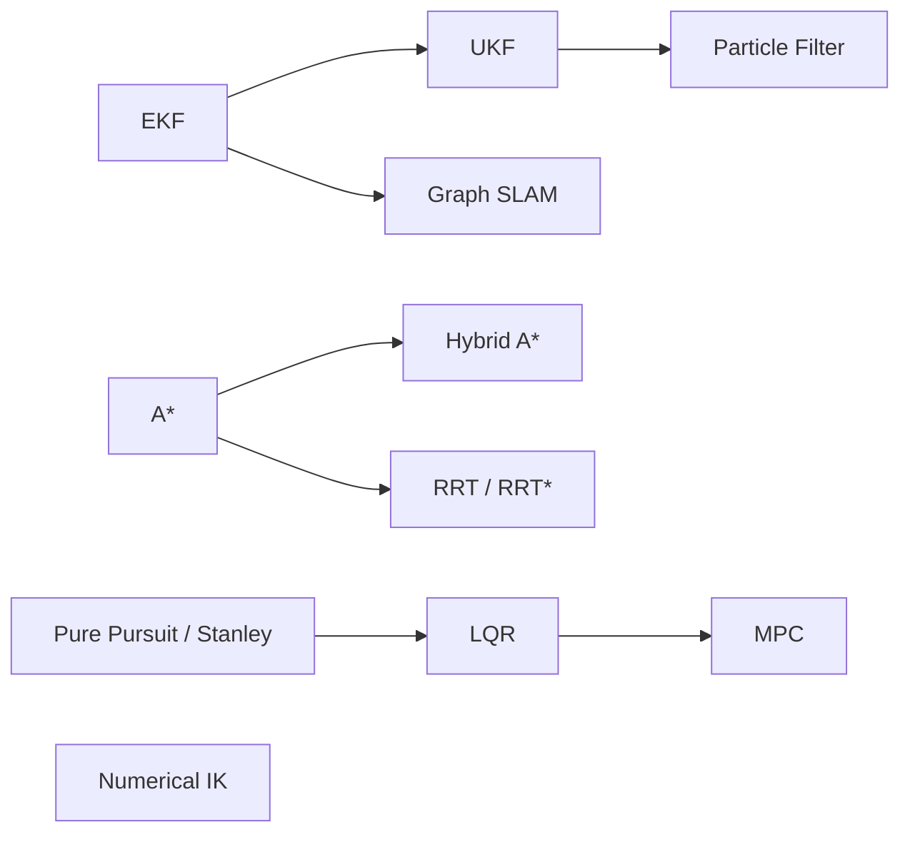

<div align="center">

# 🤖 robotics-algorithms

**From-scratch implementations of core robotics algorithms in Python and C++17**
*Derived, implemented, and validated, one algorithm at a time.*


</div>

---

## About

This repository is a structured study of the algorithms behind robot state estimation, mapping, planning, and control. Each algorithm lives in its own folder and is built twice:

| | Role |
|---|---|
| 🐍 **Python** | Reference implementation, used to work out the math and iterate quickly |
| ⚙️ **C++17 + Eigen** | Engineering implementation, built with CMake |

Both implementations run on the **same scenario data file** and are checked against each other, so the C++ version is verified rather than assumed correct.

> [!NOTE]
> This is a learning repository, currently focused on building conceptual
> understanding of each algorithm. Formal test suites (finite-difference
> Jacobian checks, NEES/NIS consistency, etc.) are a deliberate later
> phase, not a blocker on marking an algorithm's core implementation done.
> Each algorithm's README contains the derivation in my own words, the
> assumptions it depends on, and results I measured myself.

---

## Roadmap

**Legend:** ✅ Done · 🚧 In progress · ⬜ Planned

### 📍 Localization

| Algorithm | Python | C++ | Docs |
|---|:---:|:---:|:---:|
| [Extended Kalman Filter](localization/ekf) | ✅ | 🚧 | 🚧 |
| [Unscented Kalman Filter](localization/ukf) | ⬜ | ⬜ | ⬜ |
| [Particle Filter](localization/particle_filter) | ⬜ | ⬜ | ⬜ |

### 🗺️ SLAM

| Algorithm | Python | C++ | Docs |
|---|:---:|:---:|:---:|
| [Graph-Based SLAM](slam/graph_slam) | ⬜ | ⬜ | ⬜ |

### 🧭 Path Planning

| Algorithm | Python | C++ | Docs |
|---|:---:|:---:|:---:|
| [A*](planning/a_star) | ⬜ | ⬜ | ⬜ |
| [Hybrid A*](planning/hybrid_a_star) | ⬜ | ⬜ | ⬜ |
| [RRT / RRT*](planning/rrt_star) | ⬜ | ⬜ | ⬜ |

### 🎯 Path Tracking & Control

| Algorithm | Python | C++ | Docs |
|---|:---:|:---:|:---:|
| [Pure Pursuit / Stanley](path_tracking/pure_pursuit_stanley) | ⬜ | ⬜ | ⬜ |
| [LQR](path_tracking/lqr) | ⬜ | ⬜ | ⬜ |
| [Model Predictive Control](path_tracking/mpc) | ⬜ | ⬜ | ⬜ |

### 🦾 Manipulation

| Algorithm | Python | C++ | Docs |
|---|:---:|:---:|:---:|
| [Numerical IK (Damped Least Squares)](arm/numerical_ik) | ⬜ | ⬜ | ⬜ |

### Learning path



---

## Approach

Right now, an algorithm is marked ✅ when it meets:

1. **Python reference** runs on the shared scenario data.
2. **C++ implementation** matches the Python output within tolerance on the same data.
3. **Documentation** covers the derivation, assumptions, and measured results.

Formal automated tests (finite-difference Jacobian checks, NEES/NIS
consistency, etc.) are planned as a later phase across the whole repo,
once the conceptual implementations are further along it is not required
per-algorithm for now.

Design rules applied throughout:

- **Shared data files, not shared seeds.** NumPy and C++ random generators produce different streams, so each scenario is generated once and saved as CSV for both languages to read.
- **Algorithm code stays pure.** Filters, planners, and controllers contain no plotting or file I/O. Demos handle that separately.
- **Measured results only.** Every number reported comes from a run I can reproduce.

---


## 📁 Repository Structure

Each algorithm is a self-contained study, organized by area:

<details>
<summary><b>Click to expand</b></summary>

```
robotics-algorithms/
├── README.md
├── requirements.txt
├── CMakeLists.txt              # builds every algorithm for CI
├── .github/workflows/ci.yml
└── localization/
    └── ekf/
        ├── README.md           # derivation, assumptions, results
        ├── data/               # shared scenario CSVs
        ├── img/                # result plots
        ├── python/
        │   ├── ekf.py          # algorithm only
        │   ├── demo.py         # load data, run, plot
        │   └── gen_data.py     # generates scenario data
        └── cpp/
            ├── CMakeLists.txt  # standalone project
            ├── ekf.hpp / ekf.cpp
            └── demo.cpp
```

</details>

---

## References

- **Thrun, Burgard & Fox**, *Probabilistic Robotics*: localization and SLAM
- **Lynch & Park**, *Modern Robotics*: kinematics, inverse kinematics, and control
- **LaValle**, *Planning Algorithms*: search and sampling-based planning

## Acknowledgments

The choice of algorithms and the simulation scenarios are inspired by [PythonRobotics](https://github.com/AtsushiSakai/PythonRobotics) by Atsushi Sakai (MIT License). The implementations here are written independently.

## License

[MIT](LICENSE) © P Pranav