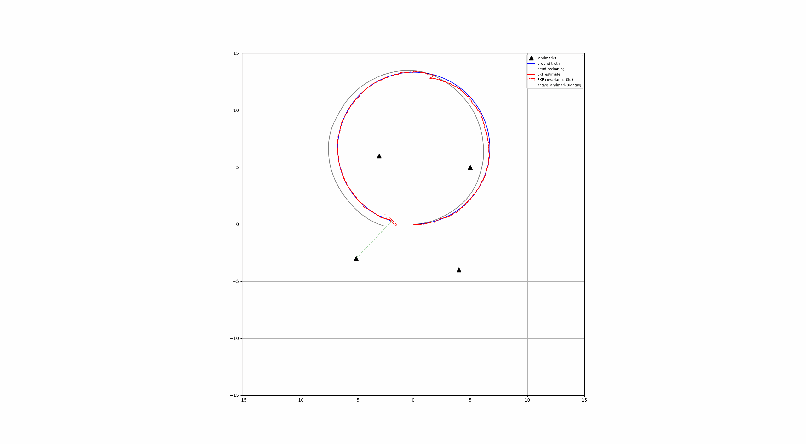
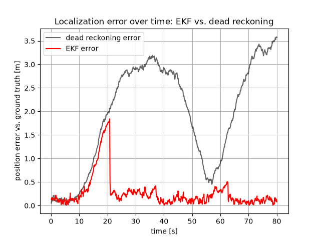

# Landmark-Based Localization (EKF)

**Problem:** Estimate a differential-drive robot's pose `[x, y, θ]` using an
Extended Kalman Filter, fusing noisy odometry (`[v, ω]`) with noisy
**range-bearing observations** to known landmarks — as opposed to the
GPS-only EKF, where the sensor model is linear and always available.

**Why it's harder than GPS-only EKF:**
- Observation model `h(x) = [r, β]ᵀ` is nonlinear (`sqrt`, `atan2`),
  requiring a hand-derived Jacobian instead of a constant selector matrix
- Landmarks are only visible within sensor range — filter must handle
  predict-only timesteps when no landmark is in view
- Multiple landmarks may be visible simultaneously

**State:** `x = [x, y, θ]ᵀ`

**Observation model** (landmark `i` at known `(lx, ly)`):
```
r = sqrt((lx-x)² + (ly-y)²)
β = atan2(ly-y, lx-x) - θ
```

**Observation Jacobian** `∂h_i/∂x`:
```
[ (x-lx)/r     (y-ly)/r     0  ]
[ (ly-y)/r²   (x-lx)/r²   -1  ]
```

## Simulation



Ground truth (blue), dead reckoning (gray), EKF estimate (red) with 3σ
covariance ellipse, and active landmark sightings (green dashed) during
a driven loop through a field of known landmarks.

## Evaluation



Per-timestep position error against ground truth, EKF vs. dead
reckoning, over an 80s run:

| | RMSE | Max | Final |
|---|---|---|---|
| EKF | 0.429 m | 1.844 m | 0.083 m |
| Dead reckoning | 2.232 m | 3.584 m | 3.576 m |

Dead reckoning error grows roughly unbounded with no correction; the
EKF's error stays bounded, pulled back toward zero each time a landmark
comes into sensor range.

Adapted from Atsushi Sakai's PythonRobotics EKF sample (motion model,
overall predict/update structure); range-bearing observation model and
Jacobian derived independently.