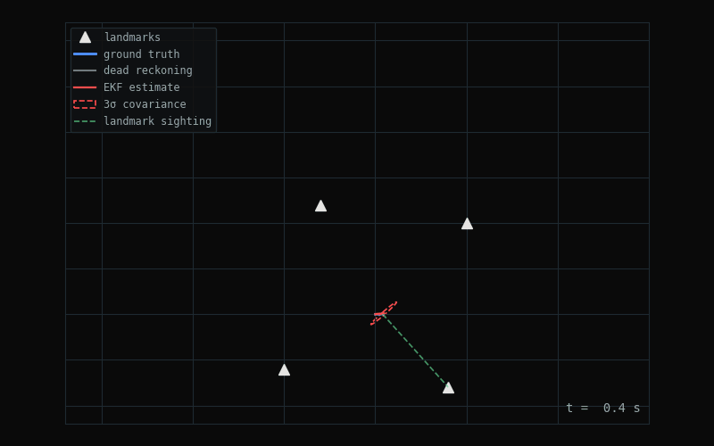
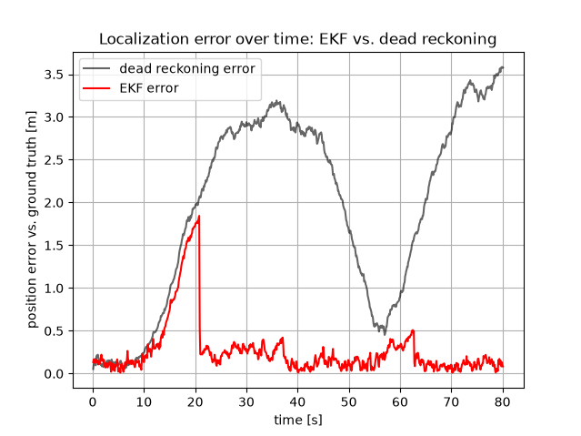
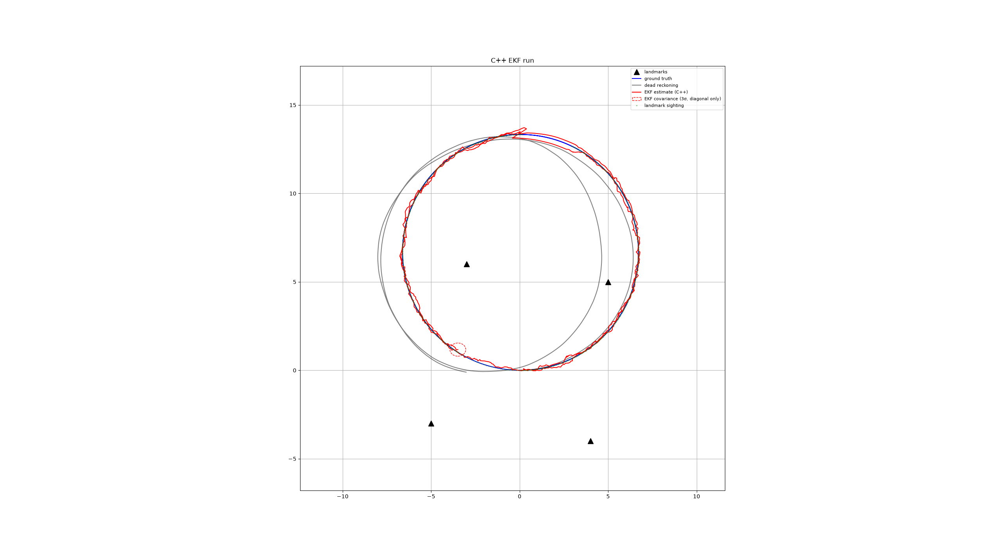

# Landmark-Based Localization (EKF)

**Problem:** Estimate a differential-drive robot's pose `[x, y, θ]` using an
Extended Kalman Filter, fusing noisy odometry (`[v, ω]`) with noisy
**range-bearing observations** to known landmarks.
- Observation model `h(x) = [r, β]ᵀ` is nonlinear (`sqrt`, `atan2`),
  requiring a hand-derived Jacobian instead of a constant selector matrix
- Landmarks are only visible within sensor range and the filter must handle
  predict-only timesteps when no landmark is in view
- Multiple landmarks may be visible simultaneously (this implementation
  updates on the single nearest visible landmark per timestep; fusing
  several at once is a possible extension, not yet done)

---

## Model

**State:** `x = [x, y, θ]ᵀ`

**Motion model** (unicycle kinematics):
```
x_{t+1} = x_t + v·Δt·cos(θ)
y_{t+1} = y_t + v·Δt·sin(θ)
θ_{t+1} = θ_t + ω·Δt
```

**Observation model** (landmark `i` at known, fixed `(lx, ly)`):
```
r = sqrt((lx-x)² + (ly-y)²)
β = atan2(ly-y, lx-x) - θ
```

**State Jacobian** `∂f/∂x` (3×3):
```
[ 1   0   -v·Δt·sin(θ) ]
[ 0   1    v·Δt·cos(θ) ]
[ 0   0        1       ]
```

**Observation Jacobian** `∂h_i/∂x` (2×3):
```
[ (x-lx)/r     (y-ly)/r    0 ]
[ (ly-y)/r²   (x-lx)/r²   -1 ]
```

Both Jacobians were derived by hand from the models above.

**Bearing wrap:** the innovation's bearing component is wrapped into
`(-π, π]` with `atan2(sin(Δβ), cos(Δβ))` before the Kalman update.
Without this, a true bearing near `+π` and a predicted bearing near `-π`
(the same physical direction) produce a spurious innovation close to
`2π` instead of near zero, causing the filter to over-correct.

**Landmark position is known and fixed** - it is an input to the
observation model and its Jacobian, never part of the state and never
estimated. This is what makes the problem localization rather than
SLAM: the map is given, only the robot's pose is uncertain.

---

## Results

### Python (reference implementation)



Ground truth (blue), dead reckoning (gray), EKF estimate (red) with 3σ
covariance ellipse, and active landmark sightings (green dashed) over an
80s driven loop through a field of known landmarks.



Per-timestep position error against ground truth:

| | RMSE | Max | Final |
|---|---|---|---|
| EKF | 0.429 m | 1.844 m | 0.083 m |
| Dead reckoning | 2.232 m | 3.584 m | 3.576 m |

Dead reckoning error grows roughly unbounded, since nothing ever
corrects it and yaw noise integrates into position drift every step. The
EKF's error stays bounded, pulled back toward ground truth each time a
landmark comes into sensor range.

### C++ (Eigen port)



Same models, Jacobians, and predict/update structure, ported to C++17
with Eigen. Run independently (different RNG, so not sample-for-sample
identical to the Python run) on the same scenario and the same landmarks,
same noise magnitudes, same simulated duration:

| | RMSE | Max | Final |
|---|---|---|---|
| EKF | 0.191 m | 0.691 m | 0.155 m |
| Dead reckoning | 2.043 m | 3.532 m | 1.212 m |

The C++ and Python numbers aren't identical because `std::mt19937` and
NumPy's generator produce different noise sequences even with a fixed
seed, so no two runs draw the same noise realizations  but they land
in the same range, and the qualitative result holds in both: the EKF
tracks ground truth about an order of magnitude better than dead
reckoning (≈5× in Python, ≈11× here). That agreement, not exact
trajectory matching, is what "checked against the Python
implementation" means for this algorithm.

**Known simplification:** the C++ plotting script only logs the
diagonal of `P` (not the off-diagonal covariance term), so its
covariance ellipse is axis-aligned rather than tilted like the Python
version's. Cosmetic only — it doesn't affect the filter itself.

---

## Attribution

Motion model and overall predict/update structure adapted from Atsushi
Sakai's [PythonRobotics](https://github.com/AtsushiSakai/PythonRobotics)
EKF localization sample. The range-bearing observation model, its
Jacobian, and the landmark-based problem setup are derived independently
for this repo.